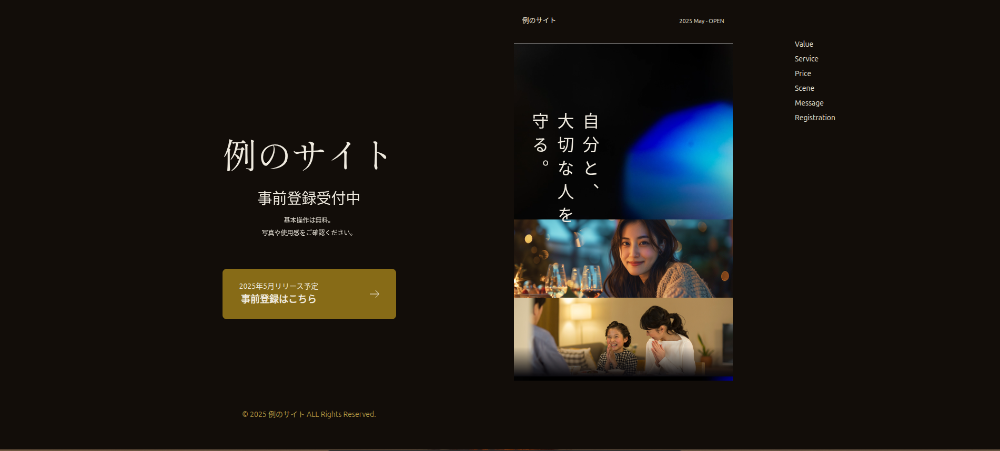

# 🚀 Example Landing Page

A modern responsive website built using HTML5, Tailwind CSS (via CDN), and AOS animations. This project is designed for showcasing services, features, and brand visuals with smooth scrolling effects and rich media content.

---

## 🛠️ Built With

- **HTML5** – Markup structure
- **CSS3** – Custom styles
- **[Tailwind CSS](https://tailwindcss.com/)** – Utility-first CSS framework (via CDN)
- **[AOS](https://michalsnik.github.io/aos/)** – Animate On Scroll Library (via CDN)
- **[Google Fonts](https://fonts.google.com/)** – For enhanced typography

---

## 📸 Screenshots

<!-- Add screenshots of your live project -->



---

## 🔗 Live Link

[Visit the Live Site](https://dev-example-site.netlify.app)

## 📂 Folder Structure

```bash
└─ .                                    # Root directory of the project
   ├─ README.MD           # Project documentation
   └─ docs/
      ├─ index.html               # Main HTML file
      ├─ tailwind.config.js     # Tailwind CSS configuration file (optional if using CDN)
      ├─ styles/                       # Custom CSS styles
      │  ├─ mobile.css           # Responsive styles for mobile devices
      │  └─ styles.css             # General styling rules
      ├─ images/                    # All project-related images
      │  ├─ fixed/
      │  ├─ hero/
      │  ├─ message/
      │  ├─ option/
      │  ├─ our-service/
      │  ├─ our-strengths/
      │  ├─ our-value/
      │  ├─ protect-your-world/
      │  ├─ readme/
      │  ├─ registration/
      │  ├─ scene/
      │  └─ service-price/
      └─ videos/
         └─ hero-bg.mp4    # Video used in the hero section background
```
